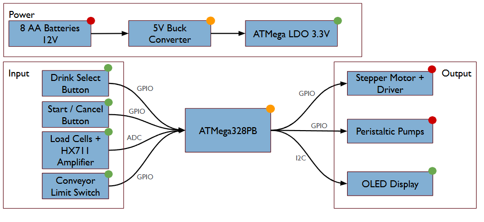
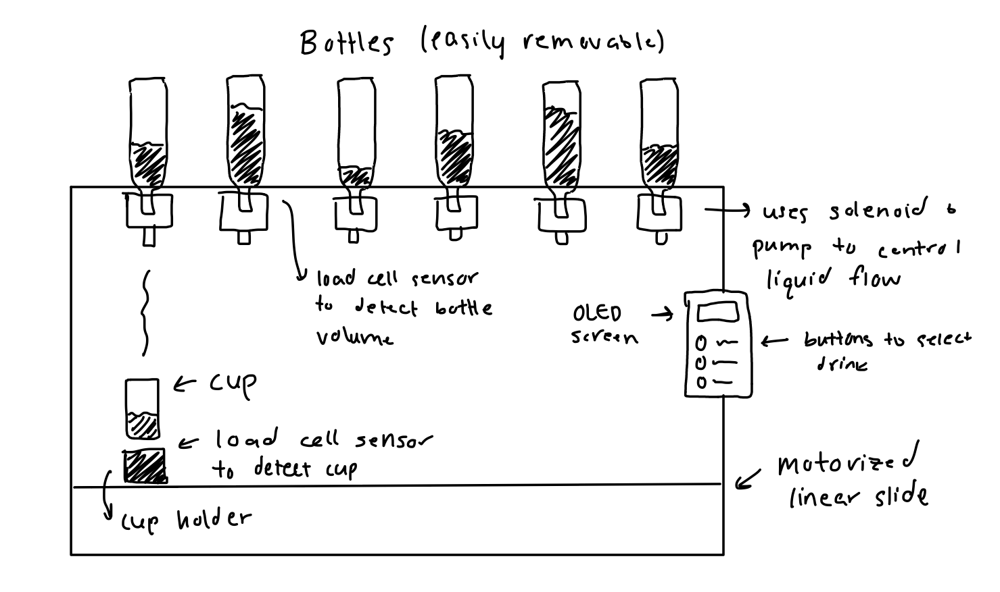

# Final Project

**Team Number:** 7

**Team Name:** Team 7

|  Team Member Name  | Email Address       |
|--------------------|---------------------|
| Lori Brown         | blor@seas           |
| Amy Luo            | amyluo@seas         |
| Jeremy Chung       | ddchung@seas        |

**GitHub Repository URL:** https://github.com/upenn-embedded/final-project-s26-t07

**GitHub Pages Website URL:** [for final submission]*

## Final Project Proposal

### 1. Abstract  
We are building an autonomous assembly-line mocktail mixer which allows users to select a drink option. We plan to use an OLED screen and buttons for drink selection and notifications. Solenoids and pumps used in conjunction with load cells for each bottle will dispense the liquid and notify the user if a bottle needs to be refilled. The cup (detected using a load cell) will move through a series of stages corresponding to each bottle.

### 2. Motivation  
Mocktail and tea prices have been going up in the past few years. It is no longer appealing to buy an 8 dollar peach oolong tea, for example, which is very easy to make. We propose an autonomous drink-maker to solve this problem and save ourselves money. We want a device that we can use at home with minimal maintenance and cost.

### 3. System Block Diagram
   
### 4. Design Sketches  
  
The critical design features include the linear slide (to move the drink forward) and the solenoid-pump system to dispense the drink. We may need to 3D print a mount for each bottle. We can laser-cut a wooden display interface for drink selection and notification (to place the OLED and buttons in). We will also need to construct an outer frame for the device, which can be done using wood (since the bottles may be too heavy for cardboard).

### 5. Software Requirements Specification (SRS)

**5.1 Definitions, Abbreviations**

**5.2 Functionality**

| ID     | Description                                                                                                                                                                                                              |
| ------ | ------------------------------------------------------------------------------------------------------------------------------------------------------------------------------------------------------------------------ |
| SRS-01 | The system shall measure bottle load cell values at least once every 1 second to determine whether sufficient liquid remains for dispensing.                                                                                                                 |
| SRS-02 | The system shall allow the user to select from available drink options using the button interface and display the selected option on the OLED screen within 1 second of input.                                                                                                                                           |
| SRS-03 | The system shall verify that a cup is present at the starting position using the load cell before beginning the drink-making sequence. |
| SRS-04 | At each dispensing station, the system shall activate the corresponding solenoid and pump for the programmed dispense duration associated with the selected drink recipe.                                                                                 |
| SRS-05 | The system shall stop the drink-making process and display an error message if the cup is not detected during any stage of operation. |
| SRS-06 | After the selected drink has been completed, the system shall display a completion message to the user within 2 seconds.                                                                                 |

### 6. Hardware Requirements Specification (HRS)

**6.1 Definitions, Abbreviations**

**6.2 Functionality**

| ID     | Description                                                                                                                        |
| ------ | ---------------------------------------------------------------------------------------------------------------------------------- |
| HRS-01 | An OLED display shall be used to present drink options, status updates, and refill notifications to the user. The display shall have a minimum resolution of 128 × 64 pixels. |
| HRS-02 |A linear motion mechanism shall be used to move the cup between dispensing stations. The mechanism shall provide enough travel distance to position the cup beneath each ingredient outlet.                                                           |
| HRS-03 | A motor shall be used to drive the linear slide and shall provide sufficient torque to move a filled cup reliably through all dispensing stages.      |
| HRS-04 | A solenoid valve and pump assembly shall be used for each ingredient bottle to control liquid dispensing.                       |
| HRS-05 |The outer frame shall be constructed from a rigid material capable of supporting the bottles, pumps, and motion system during operation.                       |

### 7. Bill of Materials (BOM)
[BOM](https://docs.google.com/spreadsheets/d/1Mw4CX4s19iIcAV7RWT3Ym583nlKp-pcjlx95vIQbqWI/edit?usp=sharing)    
  

The RoboBartender system will be centered around an ATmega328PB microcontroller, which serves as the primary controller for the device and runs bare-metal, register-level C firmware. The microcontroller manages all core system operations, including sensor acquisition, actuator control, and communication with the user interface. It was selected because it provides sufficient GPIO pins, multiple hardware timers for PWM generation, and communication peripherals such as SPI and I²C that enable reliable interaction with other components. To measure liquid quantities and detect ingredient availability, the system uses 5 kg strain-gauge load cells placed beneath the cup platform and each ingredient bottle. These sensors measure weight changes, allowing the system to detect cup presence, monitor how much liquid has been dispensed, and determine when bottles are empty. Because load cells output very small millivolt-level signals, HX711 load cell amplifier modules are used to amplify and digitize the signals so they can be read accurately by the microcontroller.

To dispense ingredients, the system uses 12 V peristaltic pumps, which allow controlled liquid flow while keeping the liquid isolated from mechanical components to maintain cleanliness. These pumps are driven using N-channel logic-level MOSFETs, which act as electronic switches so the microcontroller can control higher-current loads safely. A servo motor moves the cup platform between ingredient stations, and its position is controlled using PWM signals generated by the ATmega328PB’s hardware timers. The system provides user interaction through an SSD1306 I²C OLED display and push-button inputs, allowing users to select drink recipes and receive system status messages such as "Place Cup" or "Refill Bottle." Power is supplied by a 12 V regulated power supply, which drives the pumps and other high-power components, while a buck converter steps the voltage down to 5 V for the microcontroller, sensors, and display. Additional passive components such as resistors, capacitors, and flyback diodes are included to stabilize the circuit, filter noise, and protect components from voltage spikes generated by inductive loads like pumps and motors.

### 8. Final Demo Goals
The device will be set on a flat surface for demonstration. A drink will be selected by an audience member, and the device will create the drink. We will show how the device reacts to a drink requiring an amount of liquid from an empty bottle. 

### 9. Sprint Planning

| Milestone  | Functionality Achieved | Distribution of Work |
| ---------- | ---------------------- | -------------------- |
| Sprint #1  |  HRS-02-05             | All team members will work together to design the outer structure. Jeremy will manufacture it. Lori will design + construct the bottle-operating structure. Amy will design + construct the linear slide structure.         |
| Sprint #2  |  SRS-03, SRS-04, SRS-06            |         Lori + Amy will work on SRS-04, SRS-06. Jeremy will work on SRS-03.             |
| MVP Demo   |   All other specifications                     |     Amy and Jeremy work on error handling. Lori works on OLED screen and responsiveness.                 |
| Final Demo |     Stretch features                   |      All team members will work together on stretch features.                |

**This is the end of the Project Proposal section. The remaining sections will be filled out based on the milestone schedule.**

## Sprint Review #1

### Last week's progress
Last week we finalized the BOM and ordered the parts necessary for our project. We also clarified the responsibilties for each of the team members. 

### Current state of project
We have finalized the electrical schematic and the setup for our power modulator and touchscreen LED. We are in the process of CAD-designing our turntable.   

### Next week's plan
Prototype mechanical design and setup software framework (GFX library, controls, etc.) and begin integration. 

## Sprint Review #2

### Last week's progress

### Current state of project

### Next week's plan

## MVP Demo

## Final Report

Don't forget to make the GitHub pages public website!
If you’ve never made a GitHub pages website before, you can follow this webpage (though, substitute your final project repository for the GitHub username one in the quickstart guide):  [https://docs.github.com/en/pages/quickstart](https://docs.github.com/en/pages/quickstart)

### 1. Video

### 2. Images

### 3. Results

#### 3.1 Software Requirements Specification (SRS) Results

| ID     | Description                                                                                               | Validation Outcome                                                                          |
| ------ | --------------------------------------------------------------------------------------------------------- | ------------------------------------------------------------------------------------------- |
| SRS-01 | The IMU 3-axis acceleration will be measured with 16-bit depth every 100 milliseconds +/-10 milliseconds. | Confirmed, logged output from the MCU is saved to "validation" folder in GitHub repository. |

#### 3.2 Hardware Requirements Specification (HRS) Results

| ID     | Description                                                                                                                        | Validation Outcome                                                                                                      |
| ------ | ---------------------------------------------------------------------------------------------------------------------------------- | ----------------------------------------------------------------------------------------------------------------------- |
| HRS-01 | A distance sensor shall be used for obstacle detection. The sensor shall detect obstacles at a maximum distance of at least 10 cm. | Confirmed, sensed obstacles up to 15cm. Video in "validation" folder, shows tape measure and logged output to terminal. |
|        |                                                                                                                                    |                                                                                                                         |

### 4. Conclusion

## References

