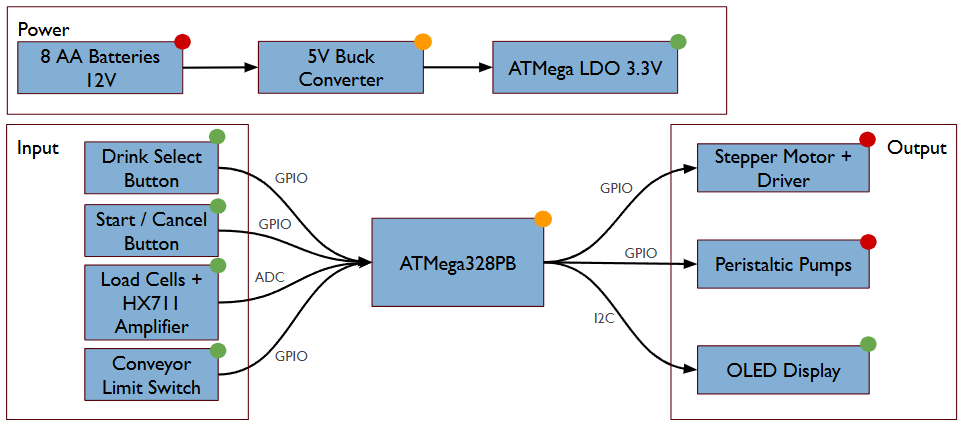
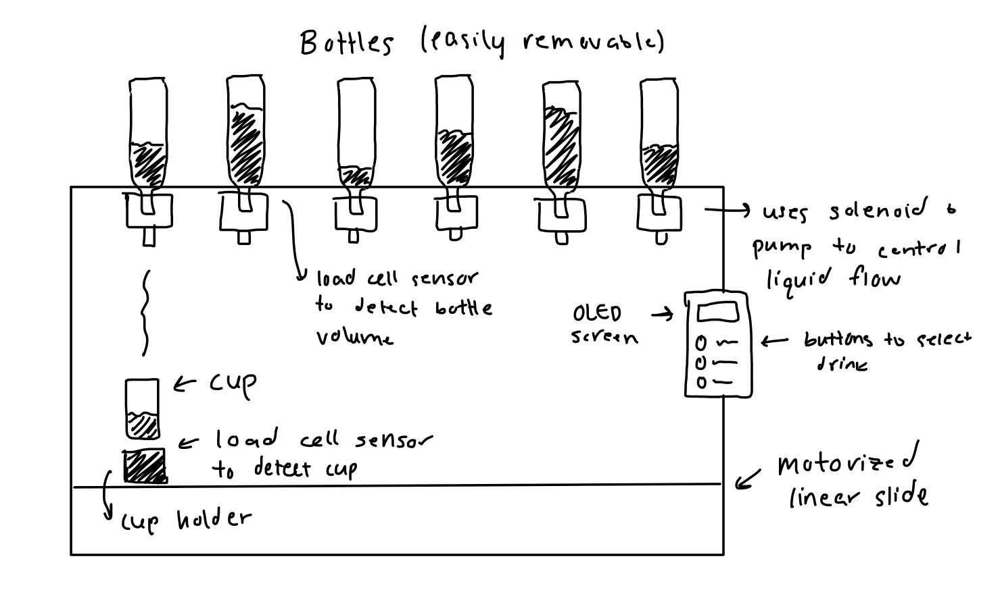
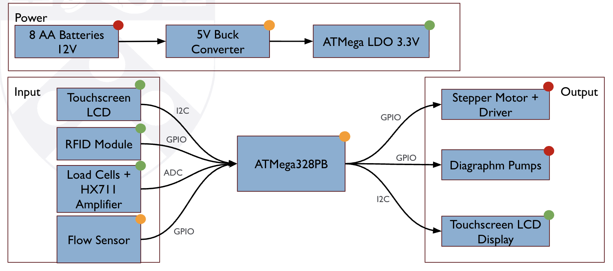

# Final Project

**Team Number:** 7

**Team Name:** Team 7

|  Team Member Name  | Email Address       |
|--------------------|---------------------|
| Lori Brown         | blor@seas           |
| Amy Luo            | amyluo@seas         |
| Jeremy Chung       | ddchung@seas        |

**GitHub Repository URL:** https://github.com/upenn-embedded/final-project-s26-t07

**GitHub Pages Website URL:** https://upenn-embedded.github.io/final-project-s26-t07/

## Final Project Proposal

### 1. Abstract  
We are building an autonomous assembly-line mocktail mixer which allows users to select a drink option. We plan to use an OLED screen and buttons for drink selection and notifications. Solenoids and pumps used in conjunction with load cells for each bottle will dispense the liquid and notify the user if a bottle needs to be refilled. The cup (detected using a load cell) will move through a series of stages corresponding to each bottle.

### 2. Motivation  
Mocktail and tea prices have been going up in the past few years. It is no longer appealing to buy an 8 dollar peach oolong tea, for example, which is very easy to make. We propose an autonomous drink-maker to solve this problem and save ourselves money. We want a device that we can use at home with minimal maintenance and cost.

### 3. System Block Diagram
   
### 4. Design Sketches  
  
The critical design features include the linear slide (to move the drink forward) and the solenoid-pump system to dispense the drink. We may need to 3D print a mount for each bottle. We can laser-cut a wooden display interface for drink selection and notification (to place the OLED and buttons in). We will also need to construct an outer frame for the device, which can be done using wood (since the bottles may be too heavy for cardboard).

### 5. Software Requirements Specification (SRS)

**5.1 Definitions, Abbreviations**

**5.2 Functionality**

| ID     | Description                                                                                                                                                                                                              |
| ------ | ------------------------------------------------------------------------------------------------------------------------------------------------------------------------------------------------------------------------ |
| SRS-01 | The system shall measure bottle load cell values at least once every 1 second to determine whether sufficient liquid remains for dispensing.                                                                                                                 |
| SRS-02 | The system shall allow the user to select from available drink options using the button interface and display the selected option on the OLED screen within 1 second of input.                                                                                                                                           |
| SRS-03 | The system shall verify that a cup is present at the starting position using the load cell before beginning the drink-making sequence. |
| SRS-04 | At each dispensing station, the system shall activate the corresponding solenoid and pump for the programmed dispense duration associated with the selected drink recipe.                                                                                 |
| SRS-05 | The system shall stop the drink-making process and display an error message if the cup is not detected during any stage of operation. |
| SRS-06 | After the selected drink has been completed, the system shall display a completion message to the user within 2 seconds.                                                                                 |

### 6. Hardware Requirements Specification (HRS)

**6.1 Definitions, Abbreviations**

**6.2 Functionality**

| ID     | Description                                                                                                                        |
| ------ | ---------------------------------------------------------------------------------------------------------------------------------- |
| HRS-01 | An OLED display shall be used to present drink options, status updates, and refill notifications to the user. The display shall have a minimum resolution of 128 × 64 pixels. |
| HRS-02 |A linear motion mechanism shall be used to move the cup between dispensing stations. The mechanism shall provide enough travel distance to position the cup beneath each ingredient outlet.                                                           |
| HRS-03 | A motor shall be used to drive the linear slide and shall provide sufficient torque to move a filled cup reliably through all dispensing stages.      |
| HRS-04 | A solenoid valve and pump assembly shall be used for each ingredient bottle to control liquid dispensing.                       |
| HRS-05 |The outer frame shall be constructed from a rigid material capable of supporting the bottles, pumps, and motion system during operation.                       |

### 7. Bill of Materials (BOM)
[BOM](https://docs.google.com/spreadsheets/d/1Mw4CX4s19iIcAV7RWT3Ym583nlKp-pcjlx95vIQbqWI/edit?usp=sharing)    
  

The RoboBartender system will be centered around an ATmega328PB microcontroller, which serves as the primary controller for the device and runs bare-metal, register-level C firmware. The microcontroller manages all core system operations, including sensor acquisition, actuator control, and communication with the user interface. It was selected because it provides sufficient GPIO pins, multiple hardware timers for PWM generation, and communication peripherals such as SPI and I²C that enable reliable interaction with other components. To measure liquid quantities and detect ingredient availability, the system uses 5 kg strain-gauge load cells placed beneath the cup platform and each ingredient bottle. These sensors measure weight changes, allowing the system to detect cup presence, monitor how much liquid has been dispensed, and determine when bottles are empty. Because load cells output very small millivolt-level signals, HX711 load cell amplifier modules are used to amplify and digitize the signals so they can be read accurately by the microcontroller.

To dispense ingredients, the system uses 12 V peristaltic pumps, which allow controlled liquid flow while keeping the liquid isolated from mechanical components to maintain cleanliness. These pumps are driven using N-channel logic-level MOSFETs, which act as electronic switches so the microcontroller can control higher-current loads safely. A servo motor moves the cup platform between ingredient stations, and its position is controlled using PWM signals generated by the ATmega328PB’s hardware timers. The system provides user interaction through an SSD1306 I²C OLED display and push-button inputs, allowing users to select drink recipes and receive system status messages such as "Place Cup" or "Refill Bottle." Power is supplied by a 12 V regulated power supply, which drives the pumps and other high-power components, while a buck converter steps the voltage down to 5 V for the microcontroller, sensors, and display. Additional passive components such as resistors, capacitors, and flyback diodes are included to stabilize the circuit, filter noise, and protect components from voltage spikes generated by inductive loads like pumps and motors.

### 8. Final Demo Goals
The device will be set on a flat surface for demonstration. A drink will be selected by an audience member, and the device will create the drink. We will show how the device reacts to a drink requiring an amount of liquid from an empty bottle. 

### 9. Sprint Planning

| Milestone  | Functionality Achieved | Distribution of Work |
| ---------- | ---------------------- | -------------------- |
| Sprint #1  |  HRS-02-05             | All team members will work together to design the outer structure. Jeremy will manufacture it. Lori will design + construct the bottle-operating structure. Amy will design + construct the linear slide structure.         |
| Sprint #2  |  SRS-03, SRS-04, SRS-06            |         Lori + Amy will work on SRS-04, SRS-06. Jeremy will work on SRS-03.             |
| MVP Demo   |   All other specifications                     |     Amy and Jeremy work on error handling. Lori works on OLED screen and responsiveness.                 |
| Final Demo |     Stretch features                   |      All team members will work together on stretch features.                |

**This is the end of the Project Proposal section. The remaining sections will be filled out based on the milestone schedule.**

## Sprint Review #1

### Last week's progress
Last week we finalized the BOM and ordered the parts necessary for our project. We also clarified the responsibilties for each of the team members. 

### Current state of project
We have finalized the electrical schematic and the setup for our power modulator and touchscreen LED. We are in the process of CAD-designing our turntable.   

### Next week's plan
Prototype mechanical design and setup software framework (GFX library, controls, etc.) and begin integration. 

## Sprint Review #2

### Last week's progress
We received a lot of our parts (but are still waiting on motors). We updated our schematics and CADs, and are assembling our parts.
### Current state of project
The parts that we have are integrated into the circuit. We are working on the GFX library.
### Next week's plan
Lasercut the structure, acquire bottles for testing, receive + integrate the rest of the parts.
## MVP Demo

### Show a system block diagram & explain the hardware implementation.
  

The system consists of a 12V battery supplying a diaphragm pump directly and a 5V buck converter powering the ATmega328PB, touchscreen LCD (SPI), RFID module (SPI), and flow sensor (GPIO interrupt), with the pump driven through a MOSFET. The touchscreen LCD provides both user input and visual output, while the RFID module allows new recipes to be loaded, and the flow sensor provides real-time feedback to the microcontroller for precise volume control. Hardware implementation uses SPI for communication with the LCD and RFID (shared bus with separate chip select lines), a MOSFET for safe high-current pump control, and a closed-loop feedback system where the ATmega turns the pump on/off based on flow sensor pulses.

### Explain your firmware implementation, including application logic and critical drivers you've written.

The firmware is structured around a simple state machine that handles user interaction and dispensing logic, with states such as idle, selection, dispensing, and completion. The application reads touch input from the LCD and RFID data to determine the selected recipe, then activates the pump via a GPIO-controlled MOSFET while counting pulses from the flow sensor using an interrupt to precisely measure dispensed volume and stop at the target. Critical drivers include SPI communication for the touchscreen LCD and RFID module, an interrupt-based flow sensor driver for accurate pulse counting, and GPIO control for the pump and any motor drivers.

### Have you achieved some or all of your Software Requirements Specification (SRS)?
SRS-01: We have made slight adjustments to this specification, as instead of load cells, we are using fluid sensors to determine whehter sufficient liquid remains for dispensing. We have a working fluid sensor that can detect the volume of liquid passing through pulse calculations, and we plan on scaling this to 4 tube systems.

SRS-02/06: We are in the process of finishing up the Graphics library for the OLED screen, so we have not completed the drink selection interface yet. 

SRS-03/05: We are in the process of finishing our cup detection mechanism. 

SRS-04: We have a pump and fluid sensor system integrated together, and we plan on scaling to 4 tube systems. 

### Have you achieved some or all of your Hardware Requirements Specification (HRS)?
HRS-01: We are in the process of finishing up the Graphics library for the OLED screen, so we have not completed the display yet, however, we have integrated the hardware and circuity for the OLED screen into our system already. 

HRS-02: We are now using a rotational motion mechanism, a lazy Susan of sorts, to move the cup between dispensing stations. This is complete, apart from a couple screws and standoffs for stability. 

HRS-03: We have finished making the rotating platform and integrated the motor. 

HRS-04: We have finished the pump and fluid sensor assembly for 1 bottle, and we will scale to 4 this week. 

HRS-05: We have finished the outer frame. 

### What is the riskiest part remaining of your project?

The riskiest part remaining of our project is probably the controls in terms of dispensing and pump activation to the specific volume, as well as the I2C communication between the drink selection on the OLED screen to the dispenser. 

### How do you plan to de-risk this?

The priority is to divide the remaining software requirements into modular subsystems so that integration is simplified, and interdependencies are minimized. For instance, using a different clock for the motor and the fluid sensor.   

### What questions or help do you need from the teaching team?
We anticipate needing some guidance in terms of some of our stretch goals within the scope of the week we have left for the project, specifically the RFID integration, so if we foresee limitations, we plan on reaching out to Andrea to communicate them and ask about advice. 

## Final Report

Don't forget to make the GitHub pages public website!
If you’ve never made a GitHub pages website before, you can follow this webpage (though, substitute your final project repository for the GitHub username one in the quickstart guide):  [https://docs.github.com/en/pages/quickstart](https://docs.github.com/en/pages/quickstart)

### 1. Video

Link to video: 
[https://drive.google.com/drive/folders/11OhObthIH71R5AcxTTE_oFgpsOQUX6Sp?usp=sharing](https://drive.google.com/drive/folders/11OhObthIH71R5AcxTTE_oFgpsOQUX6Sp?usp=sharing)

### 2. Images

### 3. Results

#### 3.1 Software Requirements Specification (SRS) Results

Note: RFID recipe loading was removed from the final system design and is not included in the final validated requirements. Drink recipes are selected through the touchscreen interface using pre-programmed recipes stored in firmware.

| ID | Description | Validation Outcome |
|------|-------------|----------------|
| SRS-01 | The system shall measure flow sensor pulse data during dispensing to determine whether the programmed liquid volume has been delivered for each ingredient. | Confirmed, dispensed volume was validated using calibrated pulse counts and flow sensor output captures, though minor volumetric deviations were observed due to flow variability. |
| SRS-02 | The system shall allow the user to select from available drink options using the touchscreen interface and display the selected option on the LCD within 1 second of input. | Confirmed, touchscreen responsiveness was demonstrated in video and verified by timing user input to display update. |
| SRS-03 | The system shall verify that the cup is positioned at the correct dispensing station before beginning each dispense stage of the drink-making sequence. | Confirmed, turntable indexing and cup positioning were demonstrated in validation videos showing correct station alignment prior to dispensing. |
| SRS-04 | At each dispensing station, the system shall activate the corresponding pump for the programmed dispense volume associated with the selected drink recipe. | Partially achieved, recipe sequencing and multi-ingredient dispensing were demonstrated successfully, though occasional dispensing inaccuracies and timing inconsistencies introduced small recipe composition errors. |
| SRS-05 | The system shall stop the drink-making process and display an error message if a dispensing fault, positioning fault, or invalid operating condition is detected during any stage of operation. | Confirmed, fault handling was validated through induced error cases and demonstrated through LCD error messaging. |
| SRS-06 | After the selected drink has been completed, the system shall display a completion message to the user within 2 seconds. | Confirmed, completion message timing was verified through recorded demonstrations and LCD output. |

#### 3.2 Hardware Requirements Specification (HRS) Results

| ID | Description | Validation Outcome |
|------|-------------|----------------|
| HRS-01 | A touchscreen LCD shall be used to present drink options, status updates, and dispensing notifications to the user. The display shall support graphical output and touch input for recipe selection. | Confirmed, LCD graphics and touch functionality were demonstrated in system operation videos. |
| HRS-02 | A rotational motion mechanism shall be used to move the cup between dispensing stations. The mechanism shall provide sufficient angular positioning accuracy to align the cup beneath each ingredient outlet. | Confirmed, turntable positioning accuracy was validated through repeated dispensing alignment tests. |
| HRS-03 | A motor shall be used to drive the rotational platform and shall provide sufficient torque to move a filled cup reliably through all dispensing stages. | Partially achieved, the motor successfully drove the turntable during demonstrations, though intermittent driver overheating introduced reliability limitations during extended operation. |
| HRS-04 | A diaphragm pump and flow sensor assembly shall be used for each ingredient bottle to control and monitor liquid dispensing. | Confirmed, pump-flow sensor subsystem performance was validated through flow measurements and dispensing demonstrations, with minor calibration variability observed. |
| HRS-05 | The outer frame shall be constructed from a rigid material capable of supporting the bottles, pumps, tubing, electronics, and rotational motion system during operation. | Confirmed, mechanical frame integrity was demonstrated during integrated system testing with no structural failures observed. |
| HRS-06 | A regulated power and switching subsystem, including MOSFET-based pump drivers, shall be used to safely provide power and control for the microcontroller, sensors, display, and actuators. | Partially achieved, switching and power delivery functioned as intended, though motor driver thermal issues indicated areas for improvement in sustained power handling. |

### 4. Conclusion

This project taught us a great deal about embedded system design, particularly the challenge of integrating mechanical, electrical, and software subsystems into a functioning system. We learned that designing individual subsystems is often much easier than making them work together reliably, and that debugging integration issues can take significantly more time than expected. 

Several aspects of the project went well. One major success was our ability to adapt the specifications to better fit the realities of implementation, particularly pivoting from a linear slide architecture to a rotational dispensing platform, which simplified mechanical complexity while still satisfying the project goals. Our modular subsystem approach also worked well, allowing us to independently develop the touchscreen interface, pump-flow sensor control, and turntable mechanism before integrating them. We were also able to demonstrate a complete autonomous dispensing sequence, which was a major milestone.

We are particularly proud of building a fully functioning automated drink dispensing prototype from the ground up and getting multiple subsystems, including a touchscreen UI, flow-controlled pumps, turntable positioning, and embedded control firmware, to operate together. We are also proud of working through several design pivots rather than forcing the original concept when it was no longer optimal. 

From this experience, we learned that successful embedded system design is often less about the first design being correct and more about rapidly identifying constraints, adjusting requirements, and improving the design through iteration. We also gained valuable experience with debugging at both the hardware and firmware level. 

We definitely had to change our approach several times. Early on, we realized integration introduced issues that were not obvious when testing subsystems independently, which forced us to redesign portions of both the mechanics and controls. We changed both the motion subsystem and parts of the sensing approach, and we shifted focus from adding features to prioritizing robustness of the core functionality.

In hindsight, some things could have been done differently. More time spent on subsystem interface planning and early integration testing would have likely reduced late-stage debugging. We also could have prioritized power architecture and driver thermal considerations much earlier, since these became significant bottlenecks later in the project. More extensive calibration testing earlier in development would also have improved dispensing accuracy.

We did encounter obstacles we did not anticipate, especially around power management, which took significantly longer than expected. Managing multiple loads, protecting switching circuits, handling motor driver overheating, and ensuring stable operation under varying loads turned out to be much more challenging than initially assumed. Integration issues between mechanical motion and dispensing control also created challenges we had not fully predicted.

A potential next step for this project would be improving calibration and dispensing accuracy so recipes can be reproduced more consistently. Additional work could include closed-loop control improvements, more robust motor driving hardware, and expanding the recipe system through RFID or another dynamic recipe loading method. Beyond that, scaling to a more polished and reliable consumer-facing prototype with improved mechanical packaging and expanded drink customization would be an exciting continuation of the project.

## References

